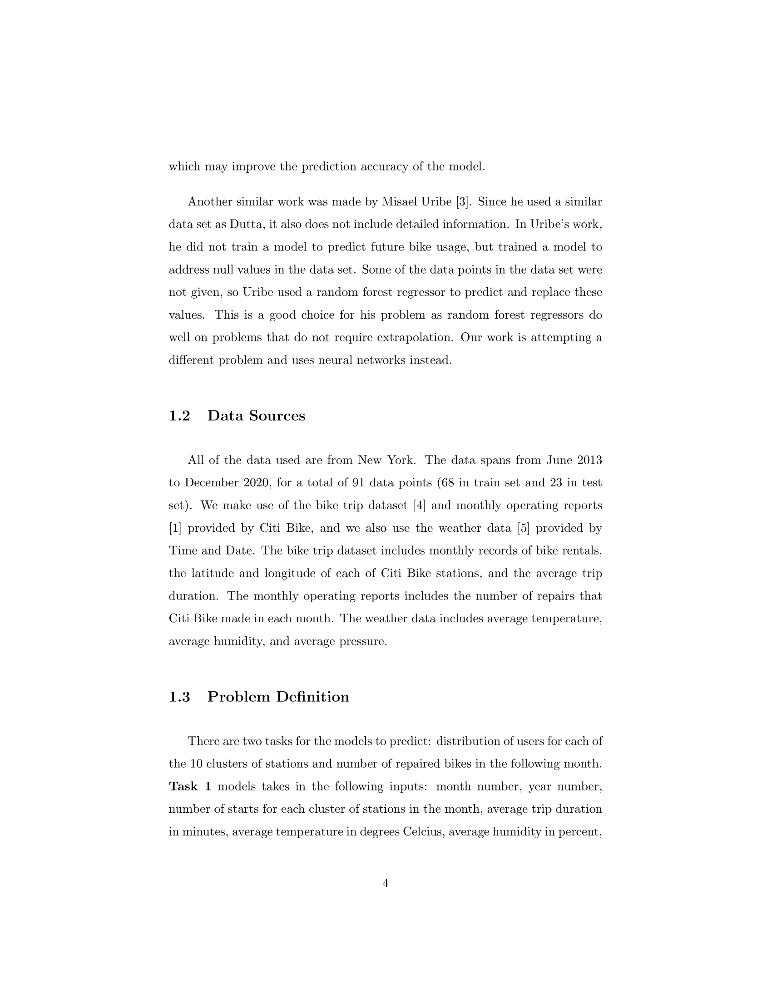

# A Deep Learning Approach to Predict the Number of Bikes a Bike Sharing Company Repairs
Ryan wong

Bike sharing companies constantly need to repair damaged bikes and
redistribute them to different stations; this could be done more efficiently
with a prediction for the number of damaged bikes needing repair and
distributions of users across each station. Existing work on bike sharing
data is limited by the use of a linear regression model, which assumes that
there is a linear relationship between the historical usage statistics and
the future demand. In addition, prior work has not taken advantage of detailed data, such as number of users for each station. This paper uses deep
neural networks to predict the future demand based on historical data,
including: temperature, humidity, air pressure, users per station, and average duration of each trip. We compared neural networks to linear-based
techniques on the mean-square error between the target values and predicted values. Experiments show that a deep learning approach produced
more useful and accurate predictions than linear-based techniques on both
the future demand and future number of repairs. This suggests that the
data does not have a linear relationship. We also examined the results
of using detailed data over less detailed data. Experiments show that
more detailed data improved prediction accuracy of the neural networks,
but reduced the accuracy of linear regression. Lastly, we removed individual input features; results show that neural networks are significantly
impacted due to the removal of features but not linear regression

Full essay could be found in Yau_Report.pdf

**How to Run Experiment**

Simply go to Code/main.ipynb and rerun all the cells. Change the seed number in line 8 of the first cell if you want a different random seed. If you want to retrain any models, simply delete the corresponding .pt file in Data.

Changing the clustering would require much more work.
1. Create a new directory called "Bike" in Data
2. Go to https://s3.amazonaws.com/tripdata/index.html and download all files from 201306 until 202101, except for 201307-201402-citibike-tripdata.zip
3. Unzip the downloaded files into the Bike directory created in step 1
4. Make sure the files appear in the same order as https://s3.amazonaws.com/tripdata/index.html
5. Delete Data/data.dat and Data/stations.dat
6. Rerun all cells in Code/main.ipynb

